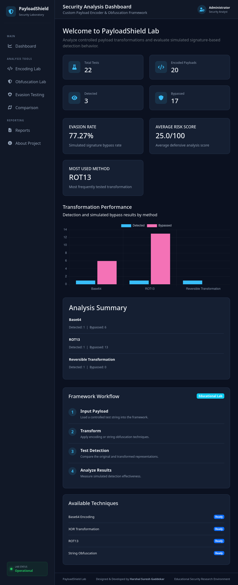
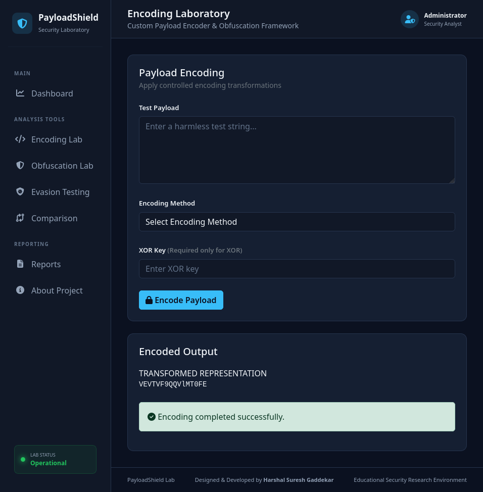
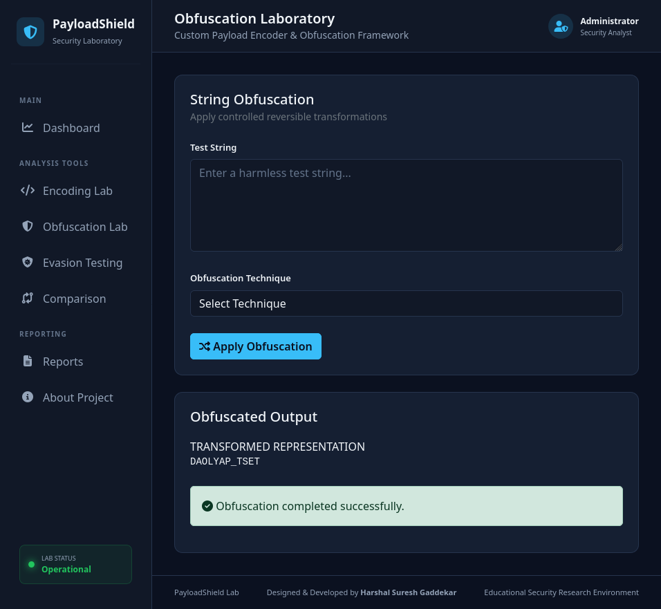
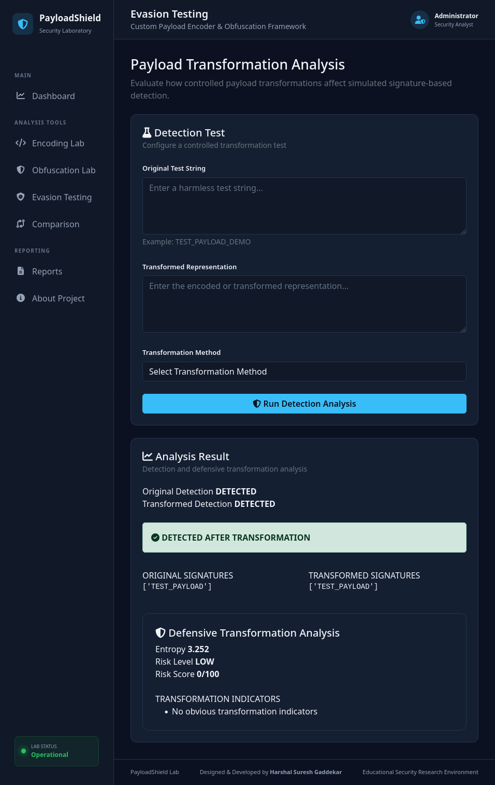
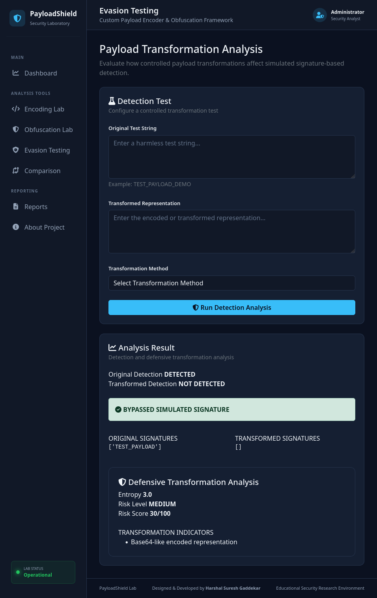
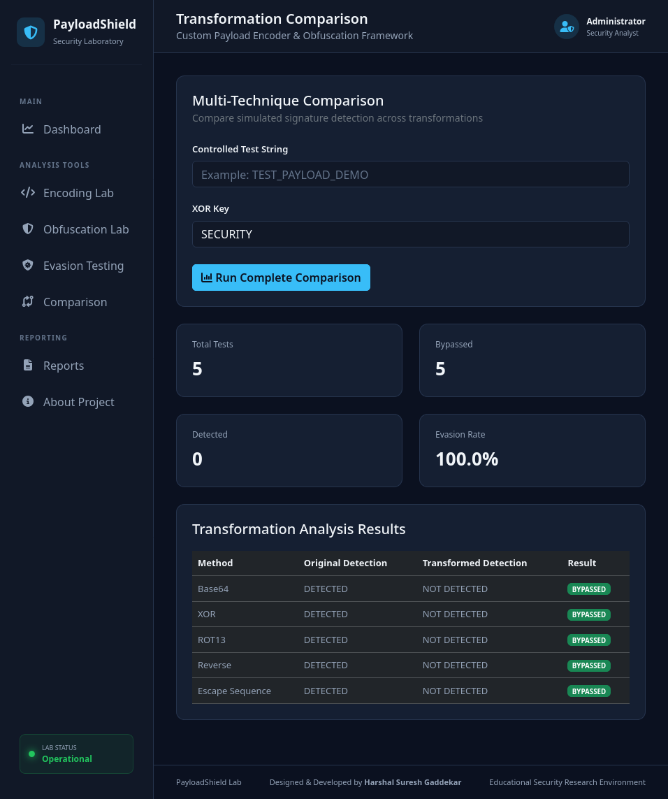
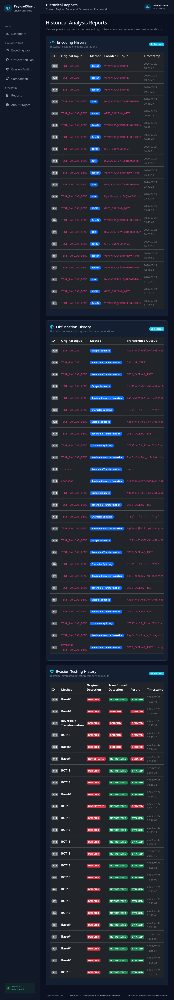
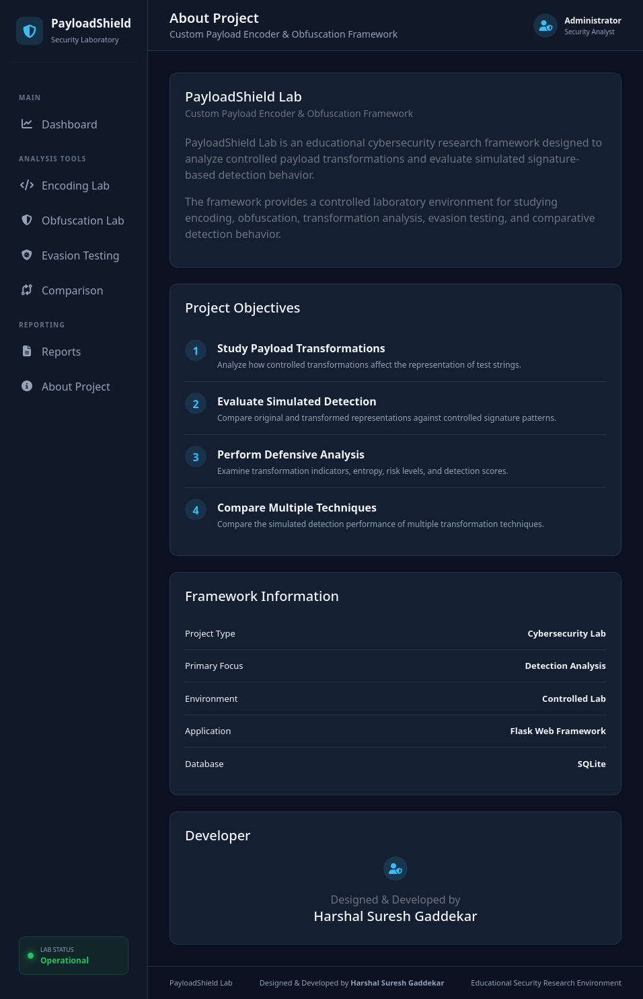
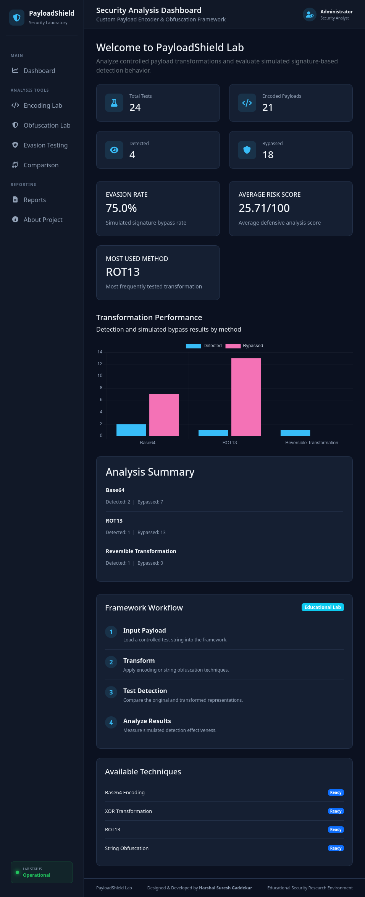

# 🛡 Custom Payload Encoder & Obfuscation Framework

### Educational Cybersecurity Research Platform


A professional **Cybersecurity Internship Project** developed using **Python**, **Flask**, **SQLite**, **Bootstrap 5**, **HTML5**, and **CSS3**.

Custom Payload Encoder & Obfuscation Framework is a web-based educational cybersecurity research platform that demonstrates payload encoding, string obfuscation, simulated signature detection, transformation comparison, defensive analysis, dashboard analytics, and historical reporting in a safe laboratory environment.

> **Disclaimer:** This project has been developed strictly for cybersecurity education, academic research, defensive analysis, and authorized laboratory demonstrations. It does **not** create, deploy, or execute malware. All payloads and signatures used are simulated for educational purposes only.

---

# 👨‍💻 Developer

**Harshal Suresh Gaddekar**

MCA Graduate

Cybersecurity Enthusiast • Python Developer • SOC Analyst Aspirant

---

# 📑 Table of Contents

- Project Overview
- Project Objectives
- Key Features
- Technology Stack
- System Architecture
- Application Workflow
- Project Structure
- Module Overview
- Installation
- Usage Guide
- Example Test Cases
- Dashboard Analytics
- Database Design
- Screenshots
- Future Enhancements
- Learning Outcomes
- License
- Disclaimer
- Author

---

# 📖 Project Overview

Custom Payload Encoder & Obfuscation Framework is a modular cybersecurity learning platform that demonstrates how different payload transformation techniques affect signature-based detection systems within a controlled environment.

Modern security products frequently rely on pattern matching, signatures, heuristics, and statistical analysis to identify suspicious content. Various encoding and string transformation techniques may alter the representation of information while preserving the original content.

This project provides a safe educational environment for understanding these concepts by integrating multiple transformation techniques, a simulated signature detection engine, defensive analysis, historical reporting, and dashboard analytics into a single web-based application.

The application is designed to demonstrate defensive cybersecurity concepts without performing offensive operations against real systems.

---

# 🎯 Project Objectives

The primary objectives of Custom Payload Encoder & Obfuscation Framework are:

- Demonstrate common payload encoding techniques.
- Demonstrate multiple string obfuscation methods.
- Simulate signature-based detection.
- Compare detection results before and after transformation.
- Analyze transformed data from a defensive perspective.
- Calculate Shannon entropy for transformed strings.
- Identify transformation indicators.
- Generate transformation risk scores.
- Store historical analysis inside SQLite.
- Present dashboard analytics through a professional web interface.

---

# ✨ Key Features

- 🔐 Payload Encoding Laboratory
- 🔄 String Obfuscation Laboratory
- 🛡 Simulated Signature Detection Engine
- 📊 Transformation Comparison Module
- 📈 Defensive Transformation Analysis
- 🎯 Risk Score Calculation
- 📉 Shannon Entropy Analysis
- 📚 Historical Activity Reports
- 💾 SQLite Database Integration
- 📊 Dashboard Analytics
- 🌐 Flask Web Interface
- 🎨 Responsive Bootstrap Dashboard
- ⚙ Modular Python Architecture

---

## 📈 Project Statistics

- **Programming Language:** Python 3.13
- **Framework:** Flask
- **Database:** SQLite
- **Frontend:** HTML5, CSS3, Bootstrap 5
- **Modules:** 8+
- **Templates:** 9
- **Database Tables:** 4
- **Transformation Techniques:** 7
- **Defensive Analysis Indicators:** 4
- **Project Type:** Cybersecurity Internship Project

---

# 🛠 Technology Stack

| Category | Technology |
|-----------|------------|
| Programming Language | Python 3.13 |
| Web Framework | Flask |
| Database | SQLite |
| Frontend | HTML5 |
| Styling | CSS3 |
| UI Framework | Bootstrap 5 |
| Icons | Bootstrap Icons |
| Database API | SQLite3 |
| Operating System | Kali Linux |
| Version Control | Git & GitHub |
| IDE | Visual Studio Code / Linux Terminal |
| Architecture | Modular Flask Application |

---

# 🏗 System Architecture

```text
                           +----------------------+
                           |        User          |
                           +----------+-----------+
                                      |
                                      |
                                      ▼
                           +----------------------+
                           |   Flask Web Server   |
                           +----------+-----------+
                                      |
        ----------------------------------------------------------------
        |             |                |              |                 |
        ▼             ▼                ▼              ▼                 ▼
+---------------+ +---------------+ +-------------+ +-------------+ +--------------+
| Encoding Lab  | | Obfuscation   | | Detection   | | Comparison  | | Reports      |
|               | | Lab           | | Engine      | | Engine      | | Module       |
+-------+-------+ +-------+-------+ +------+------+ +------+------+ +------+-------+
        |                 |                 |                |                |
        -----------------------------------------------------------------------
                                      |
                                      ▼
                        +-----------------------------+
                        | Defensive Transformation    |
                        | Analyzer                    |
                        +-------------+---------------+
                                      |
                                      ▼
                          +-------------------------+
                          | SQLite Database         |
                          | Historical Records      |
                          +-------------+-----------+
                                        |
                                        ▼
                           +-------------------------+
                           | Dashboard Analytics     |
                           +-------------------------+
```

---

# 🔄 Application Workflow

```text
User Opens Application
            │
            ▼
Select Desired Module
            │
            ▼
Enter Test Payload
            │
            ▼
Apply Transformation
            │
            ▼
Signature Detection
            │
            ▼
Defensive Analysis
            │
            ▼
Entropy Calculation
            │
            ▼
Risk Score Generation
            │
            ▼
Store Results in SQLite
            │
            ▼
Dashboard Analytics Updated
            │
            ▼
Historical Reports Available
```

---

# 📂 Project Structure

```text
CustomPayloadEncoderObfuscationFramework/
│
├── app.py
├── config.py
├── requirements.txt
├── README.md
├── .gitignore
│
├── database/
│   └── payload_framework.db
│
├── modules/
│   ├── comparison.py
│   ├── database.py
│   ├── defensive_analyzer.py
│   ├── detector.py
│   ├── encoder.py
│   ├── obfuscator.py
│   ├── report_generator.py
│   └── __init__.py
│
├── templates/
│   ├── about.html
│   ├── base.html
│   ├── comparison.html
│   ├── dashboard.html
│   ├── encoder.html
│   ├── evasion.html
│   ├── login.html
│   ├── obfuscator.html
│   └── reports.html
│
├── static/
│   ├── css/
│   ├── js/
│   └── images/
│
└── screenshots/
```

---

# 📚 Module Overview

The application is divided into multiple independent modules that work together to provide a complete educational cybersecurity laboratory.

---

## 🏠 Dashboard

The Dashboard serves as the central monitoring interface of the application.

It automatically retrieves historical information from the SQLite database and displays analytical statistics.

### Dashboard Features

- Total Encoding Operations
- Total Evasion Tests
- Successfully Bypassed Tests
- Detected Transformations
- Overall Evasion Rate
- Average Risk Score
- Most Frequently Used Transformation
- Transformation-wise Analytics

---

## 🔐 Encoding Lab

The Encoding Lab demonstrates how different encoding techniques modify the appearance of textual payloads.

Supported algorithms include:

- Base64 Encoding
- XOR Encoding
- ROT13 Transformation

Every encoding operation is automatically recorded inside the database.

The Encoding Lab is intended to demonstrate data representation changes rather than encryption or offensive payload creation.

---

## 🔄 Obfuscation Lab

The Obfuscation Lab demonstrates representation-based string transformations.

Available techniques include:

- Random Character Insertion
- Character Splitting
- Reverse Transformation
- Escape Sequence Representation

These transformations preserve educational value by showing how string appearance changes without executing any code.

Every transformation is automatically stored inside the historical database.

---

## 🛡 Simulated Signature Detection Engine

The Detection Engine contains a predefined collection of educational test signatures.

Example signatures include:

- TEST_PAYLOAD
- MALWARE_SIMULATION
- SUSPICIOUS_COMMAND
- DEMO_THREAT_PATTERN

Whenever a payload is submitted, the engine compares the input against the simulated signature database.

Possible outcomes include:

- Detected
- Not Detected

This module is implemented entirely for controlled educational demonstrations.

---

## 📊 Comparison Analysis Module

The Comparison Analysis module automatically evaluates multiple transformation techniques using a single payload.

The following techniques are tested simultaneously:

- Base64
- XOR
- ROT13
- Reverse
- Escape Sequence

The module calculates:

- Detection Status
- Transformation Results
- Successful Bypass Count
- Detection Count
- Overall Evasion Rate

This provides an easy comparison of different transformation techniques.

---

## 🛡 Defensive Transformation Analyzer

The Defensive Analyzer evaluates transformed strings using multiple analytical indicators.

The analysis includes:

- Shannon Entropy
- Base64 Pattern Recognition
- Escape Sequence Detection
- Concatenation Detection
- Transformation Indicators
- Risk Score
- Risk Classification

Risk levels are categorized as:

- LOW
- MEDIUM
- HIGH

This module demonstrates defensive inspection techniques commonly used during security investigations.

---

## 📑 Reports Module

The Reports module provides complete historical visibility of every operation performed within the framework.

Stored information includes:

- Encoding History
- Obfuscation History
- Evasion Results
- Risk Scores
- Transformation Methods
- Detection Outcomes
- Execution Timestamps

The report history allows users to review previous analyses and monitor overall testing activity.

---

# 🚀 Installation

## Clone the Repository

```bash
git clone https://github.com/HarshalGaddekar21/Custom-Payload-Encoder-Obfuscation-Framework.git
```

> Replace the repository URL with your actual GitHub repository URL if it is different.

---

## Navigate to the Project Directory

```bash
cd CustomPayloadEncoderObfuscationFramework
```

---

## Create a Virtual Environment

```bash
python -m venv venv
```

---

## Activate the Virtual Environment

### Linux

```bash
source venv/bin/activate
```

### Windows

```bash
venv\Scripts\activate
```

---

## Install Required Packages

```bash
pip install -r requirements.txt
```

---

## Run the Application

```bash
python app.py
```

---

Open your browser and visit:

```
http://127.0.0.1:5000
```

---

# 💻 Usage Guide

### 1. Dashboard

View historical statistics, transformation analytics, and overall project metrics.

---

### 2. Encoding Lab

Enter a payload, choose an encoding algorithm, and generate the transformed output.

Supported methods:

- Base64
- XOR
- ROT13

---

### 3. Obfuscation Lab

Apply one of the available transformation methods.

Available methods:

- Random Character Insertion
- Character Splitting
- Reverse Transformation
- Escape Sequence Representation

---

### 4. Evasion Testing

Provide:

- Original Payload
- Transformed Payload
- Transformation Method

The framework will:

- Detect simulated signatures
- Compare both payloads
- Calculate entropy
- Generate risk score
- Classify risk level
- Save the results

---

### 5. Comparison Analysis

Provide a single payload.

The framework automatically compares all supported transformation techniques and calculates:

- Detection Results
- Bypass Results
- Detection Rate
- Overall Evasion Rate

---

### 6. Reports

Review complete historical activity stored in SQLite.

---

# 🧪 Example Test Payloads

Example payloads for educational testing:

```
TEST_PAYLOAD_DEMO
```

```
MALWARE_SIMULATION
```

```
SUSPICIOUS_COMMAND
```

```
DEMO_THREAT_PATTERN
```

Example XOR Key

```
SECURITY
```

These payloads are included only for demonstrating the simulated signature detection engine.

---

# 🗄 Database Design

The framework stores historical information inside SQLite.

## Tables

### users

Stores user information.

---

### encoding_history

Stores:

- Original Payload
- Encoding Method
- Encoded Output
- Timestamp

---

### obfuscation_history

Stores:

- Original Payload
- Obfuscation Method
- Transformed Output
- Timestamp

---

### evasion_results

Stores:

- Original Payload
- Transformation Method
- Detection Status
- Risk Score
- Evasion Result
- Timestamp

---

# 📊 Dashboard Analytics

The dashboard automatically calculates:

- Total Encoding Operations
- Total Evasion Tests
- Total Detected Transformations
- Successful Detection Bypasses
- Overall Evasion Rate
- Average Risk Score
- Most Frequently Used Transformation
- Transformation-wise Statistics

---

---

# 📷 Project Screenshots

The following screenshots demonstrate the primary modules of Custom Payload Encoder & Obfuscation Framework.

## 🏠 Dashboard



Displays overall project statistics, transformation analytics, historical activity, average risk score, and evasion metrics.

---

## 🔐 Encoding Lab



Demonstrates Base64, XOR, and ROT13 encoding techniques for educational payload transformation.

---

## 🔄 Obfuscation Lab



Applies multiple string transformation techniques including random insertion, character splitting, reverse transformation, and escape-sequence representation.

---

## 🛡 Evasion Testing (Detected)



Shows a simulated signature that remains detectable after transformation together with defensive analysis and risk scoring.

---

## ✅ Evasion Testing (Bypassed)



Demonstrates a simulated signature that is no longer detected after transformation while providing entropy analysis and transformation indicators.

---

## 📊 Comparison Analysis



Compares multiple transformation techniques simultaneously and summarizes detection outcomes and overall evasion statistics.

---

## 📑 Reports



Displays historical records of encoding operations, obfuscation activities, and evasion testing stored in the SQLite database.

---

## ℹ️ About Project



Provides an overview of the project, its objectives, technologies, and educational purpose.

---

## 📈 Dashboard Analytics



Illustrates the populated dashboard after multiple analyses, including analytics, risk metrics, and transformation statistics.

---

---

# 🎓 Learning Outcomes

This project demonstrates practical knowledge of:

- Python Programming
- Flask Web Development
- SQLite Database Integration
- Bootstrap UI Development
- Modular Software Architecture
- String Encoding Techniques
- Payload Transformation Concepts
- Signature-Based Detection
- Defensive Analysis
- Shannon Entropy
- Cybersecurity Research Methodology
- Git & GitHub Project Management

---

# 🚀 Future Enhancements

Potential improvements include:

- PDF Report Export
- CSV Report Export
- JSON Report Export
- Automatic Report Generation
- YARA Rule Simulation
- Sigma Rule Demonstration
- Advanced Dashboard Charts
- Machine Learning-Based Classification
- REST API Support
- User Authentication
- Multi-user Environment
- Docker Deployment
- Cloud Deployment
- Dark Mode Interface
- Enhanced Visual Analytics

---

# 📄 License

This project was developed as part of a Cybersecurity Internship and academic learning initiative.

It is intended exclusively for:

- Cybersecurity Education
- Academic Research
- Defensive Security Analysis
- Authorized Laboratory Demonstrations

Unauthorized use against systems or networks without explicit permission is prohibited.

---

# ⚠ Disclaimer

Custom Payload Encoder & Obfuscation Framework is an educational research framework.

The application:

- Does **not** generate malware.
- Does **not** exploit systems.
- Does **not** bypass real-world security products.
- Does **not** include offensive capabilities.

All payloads, signatures, and transformation demonstrations are simulated for educational purposes only.

The developer assumes no responsibility for misuse of this software.

---

# 👨‍💻 Author

**Harshal Suresh Gaddekar**

**MCA Graduate**

Cybersecurity Enthusiast | Python Developer | SOC Analyst Aspirant

### Connect with Me

**GitHub**

```
https://github.com/HarshalGaddekar21
```

**LinkedIn**

```
https://www.linkedin.com/in/harshalgaddekar/
```

---

# 🙏 Acknowledgements

Special thanks to the open-source communities behind:

- Python
- Flask
- SQLite
- Bootstrap
- Git
- GitHub

for providing the technologies that made this educational project possible.

---

# ⭐ Support the Project

If you found this project helpful, consider giving it a **⭐ Star** on GitHub.

Your support helps showcase educational cybersecurity projects and encourages continued open-source development.

---

## 🛡 Custom Payload Encoder & Obfuscation Framework

**Educational Cybersecurity Research Platform**

**Cybersecurity Internship Project • 2026**

Made with ❤️ using Python, Flask, SQLite, Bootstrap 5, HTML5, and CSS3.
